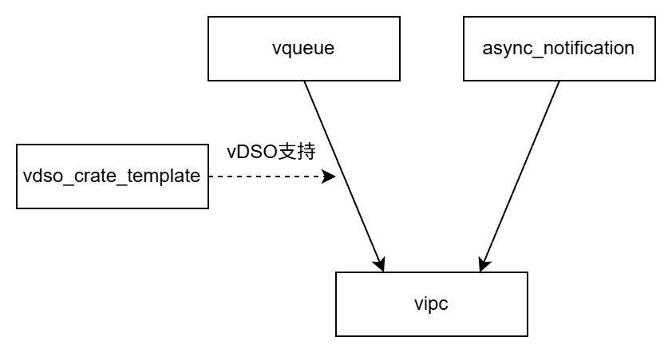

# 基于vDSO的进程间通信模块

## 简介

本项目基于[vDSO模块](https://github.com/rosy233333/vdso_crate_template)提供的vDSO功能，实现可跨操作系统的、支持Rust协程的进程间通信（IPC）模块。根据数据流（IPC消息的传递）和控制流（IPC相关协程的睡眠唤醒）的实现方式不同，本模块将实现不同的IPC通信方式，包含如下几种：

- [x] 数据流基于独立队列，控制流基于轮询的dispatcher协程
- [x] 数据流基于独立队列，控制流基于信号
- [ ] 数据流基于独立队列，控制流基于用户态中断
- [ ] 数据流和控制流均基于调度队列（该设计源于我的[结合IPC队列与调度队列](https://github.com/rosy233333/weekly-progress/blob/dev/26.1.31~26.2.6/%E6%80%9D%E8%B7%AF%E8%AE%BE%E8%AE%A1%E6%95%B4%E7%90%86.md)设计）

## 模块间结构

本项目使用的模块：

- [`vdso_crate_template`](https://github.com/rosy233333/vdso_crate_template)：提供vDSO相关支持，包括vDSO共享库的编译与加载。
- [`vqueue`](https://github.com/rosy233333/vqueue)：由vDSO管理的IPC队列等数据结构，通过vDSO实现了进程间共享。其为每个进程存储了IPC队列、进程id，以及从调度器协程到通知源id的映射，用于实现IPC的消息传递与通知功能。
- [`async_notification`](https://github.com/rosy233333/async_notification)：使用统一的接口封装信号、用户态中断等通知机制，使其可用于IPC的通知中。

## 模块内结构

- `interface.rs`：定义了不同通信方式的IPC entity采用的统一接口`LocalEntityIf`和`SharedEntityIf`，以及包装了不同类型`impl SharedEntityIf`的统一共享IPC entity类型`IPCSharedEntity`。
- `queue_based.rs`：定义了数据流基于独立队列的IPC实体，即分别实现`LocalEntityIf`和`SharedEntityIf`的两个类型。
- （未完成）`sched_based.rs`：定义了数据流和控制流均基于调度队列的IPC实体，即分别实现`LocalEntityIf`和`SharedEntityIf`的两个类型。